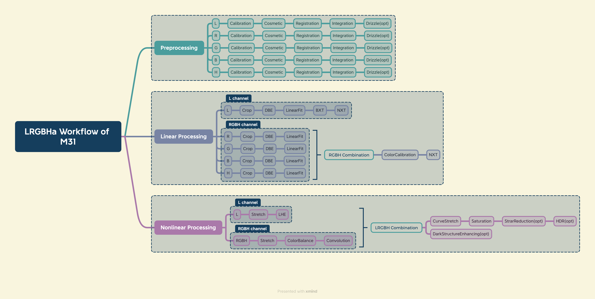

# My LRGB workflow of M31 with Ha

by aiken 07/29/2023

<!--toc:start-->
- [My LRGB workflow of M31 with Ha](#my-lrgb-workflow-of-m31-with-ha)
  - [Workflow diagram](#workflow-diagram)
  - [Linear process](#linear-process)
    - [Image Registration](#image-registration)
    - [Crop](#crop)
    - [DBE](#dbe)
    - [LinearFit](#linearfit)
    - [RGB channel](#rgb-channel)
      - [RGBHaCombination](#rgbhacombination)
      - [ColorCalibration](#colorcalibration)
      - [NXT](#nxt)
    - [L channel](#l-channel)
      - [BXT](#bxt)
      - [NXT](#nxt)
<!--toc:end-->

## Workflow diagram

## Linear process

LRGBHa图像经过wbpp预处理后，开始进入线性处理阶段（linear process）。
线性阶段的图像在屏幕上显示通常较暗，需要通过stf（screen transfer function）才能显示正常，stf在win系统下的快捷键为`ctrl+a`。值得注意的是stf只会改变图像在屏幕上的显示，并不会改变图像实际的像素值。

### Image Registration

首先，LRGBHa的图像如果在预处理阶段，没有使用同一张refference图像对齐，那么需要先进行一次图像对齐。使用StarAlignment工具对齐图像，选取一个通道作为refference，如R通道。

### Crop

LRGBHa五个通道的图像经过对齐后，在边缘区域都会有一些黑边，需要通过DynamicCrop工具剪切掉。可以先选择L通道crop，再重复crop其他通道。值得注意的是当需要把一次crop的参数应用到所有图像时，PI中Dynmaic的组件比较特殊，设置好参数后，通过底边小三角拖出的instance不能直接应用于图像，需要先选取要应用的图像，再双击instance，然后再点击底边的绿色勾，才能执行相同剪裁。详细步骤可参考grapeot的b站视频：<https://www.bilibili.com/video/BV1rp4y1t7MC?t=222.9>。另外也可以使用imageContainer来实现重复操作。

### DBE

五个通道裁剪完成后，接着对每个图像分别执行dbe（DynamicBackgroudExtraction），这一步是用来去除背景的梯度，梯度通常是由光污染导致的。

对于星系这种集中的目标，背景和目标很容易区分，可以使用sample generation功能自动生成背景选点，选点的sample radius设置为30-50，注意去除和星系较近的选点。如果边缘的选点为红色，可以适当增加tolerance 如2.00。完成选点后，拖出instance，可以对其他图像执行相同选点的dbe，过程类似crop中的操作。详细步骤可参考grapeot的视频：<https://www.bilibili.com/video/BV1rp4y1t7MC?t=372.8> 

dbe环节的注意点

- dbe的处理节点可在RGB合成后也可以在合成前，此处还有争议，有待后续研究。
- dbe环节尽可能只做一次，不要重复多次。
- dbe环节的背景去除是用减法还是除法，也没有定论，有待后续研究。

### LinearFit

接下来，图像将分为两个通道分别处理，L通道负责图像的细节，RGBHa（以下简称RGB）通道负责颜色。为了保证各通道图像合成的比例均匀，我们需要将图像在合成前做一次LinearFit。LinearFit的过程很简单，只需选取一个通道作为refference，对剩下的四个通道分别执行一次LinearFit即可。 

### RGB channel

---

#### RGBHaCombination

之后图像被分为两个通道，我们先讨论RGB通道。当图像做完LinearFit后，我可以通过PixelMath合成RGBHa的图像，此过程也可以通过RGBCombination模块来实现。使用PixelMath合成时，要注意Ha的比例，为了让Ha呈现出酒红色的小红花，我们可以用0.15的R和0.08的B合成Ha。这样我们就得到了一张RGBH的合成图像，以下简称RGB图像。

#### ColorCalibration

接着对合成的RGB图像进行颜色校准，此过程可以通过脚本AutoColor自动完成，颜色校准后的图像会有一些偏色，如偏绿，我们在非线性的过程再来去除。

#### NXT

对色彩校准后的图像进行一次denoice，推荐使用三件套中NXT来完成，需要注意的是NXT的参数，可以通过对一小块区域的preview尝试得到，denoice的标准，参考NGC马拉松，即背景区域有一些黑色斑驳即可，如下图，如果denoice太大，会给人画面油油的感觉。

### L channel

---

#### BXT

对于L通道我们主要考虑突出图像的细节，在线性处理阶段，我们第一步要做的是deconvlution，这一步主要是抵消成像设备的点扩散函数对图像的影响，提升星云和星系的细节，缩小星点的大小，有助于改善星点脱线和对焦不准等问题。推荐使用三件套的BXT工具，或者Ezydenoice脚本。

#### NXT

完成BXT后，做一次NXT去噪，完成图像线性部分的处理工作。

